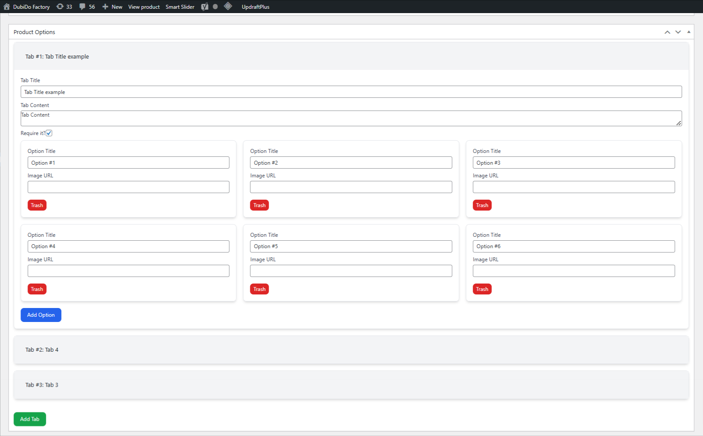
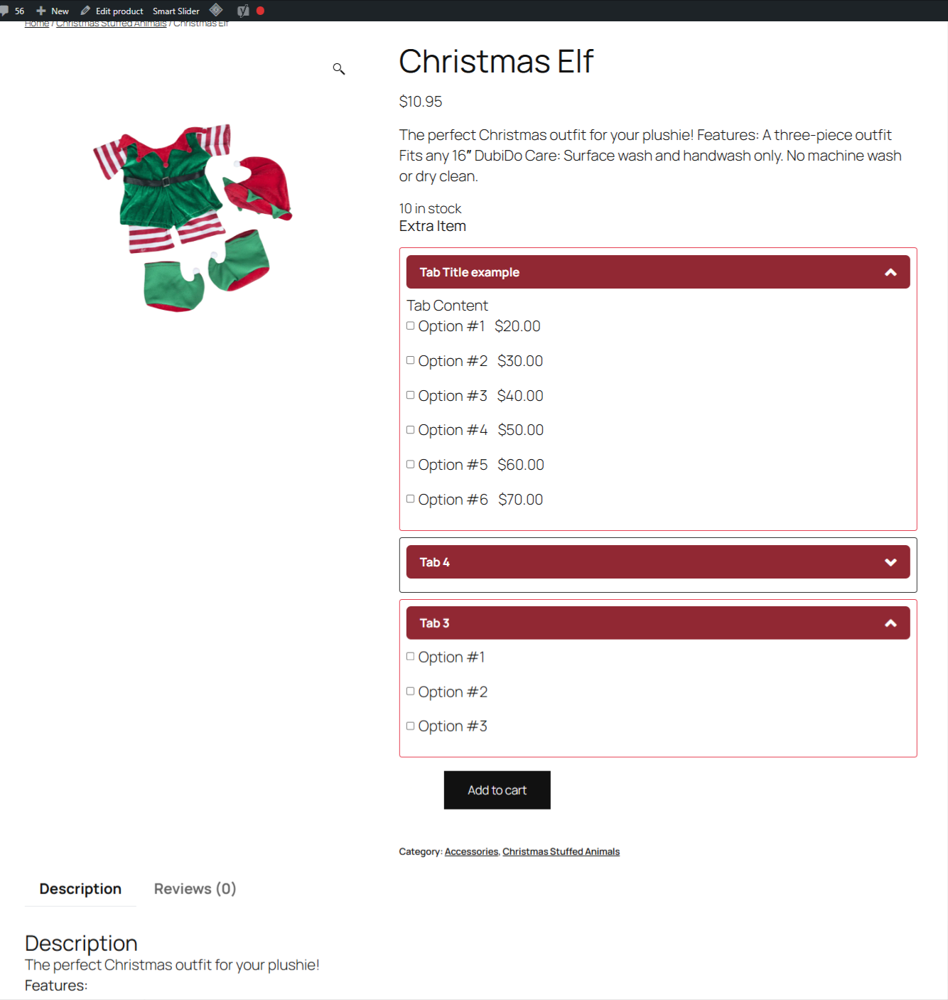
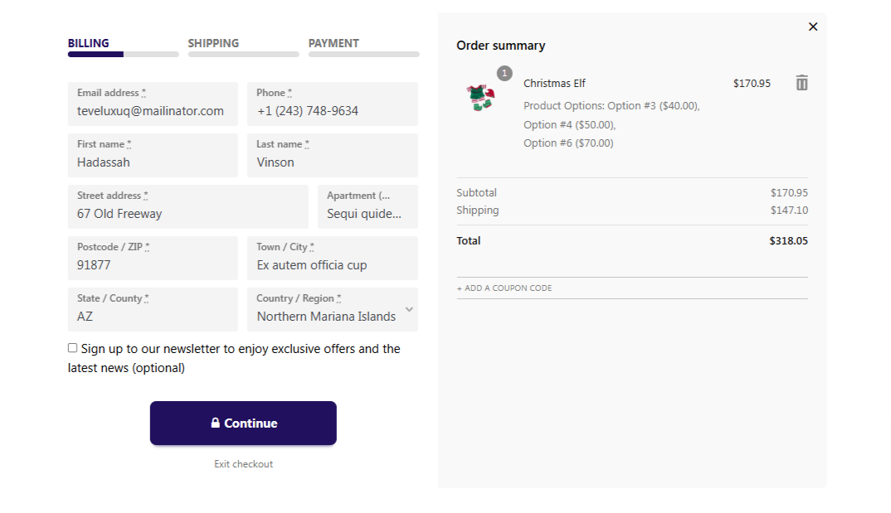
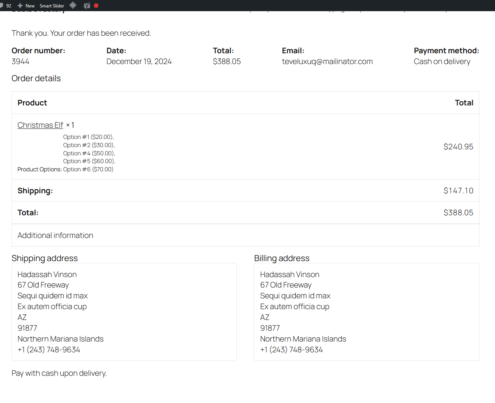
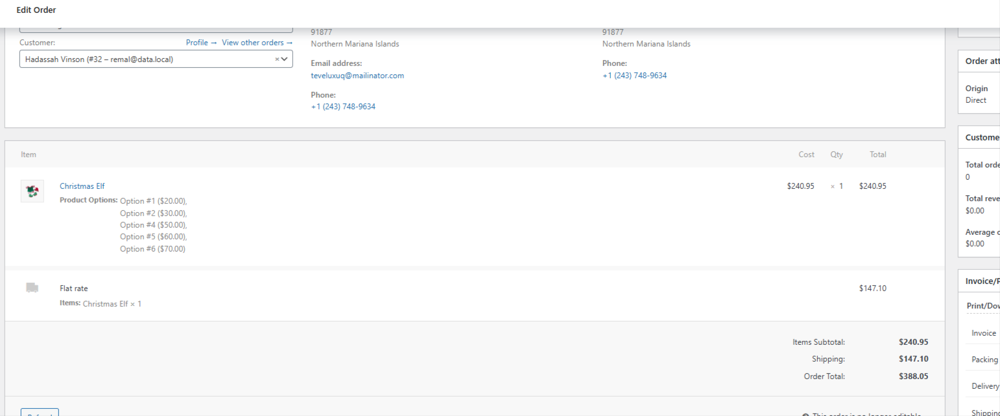

# WooCommerce Extra Addons Plugin

## Overview
The WooCommerce Extra Addons plugin allows you to add extra options to your WooCommerce products. These options can be configured from the backend and displayed on the product details page. The selected options will affect the total product price and will be shown in the cart, checkout, and order details.

## Features
- Add extra options to WooCommerce products.
- Options can be configured with a title and price.
- Options are displayed as radio buttons on the product details page.
- The total product price is updated based on the selected options.
- Selected options are shown in the cart, checkout, and order details.

## Installation
1. Download the plugin files.
2. Upload the plugin folder to the `/wp-content/plugins/` directory.
3. Activate the plugin through the 'Plugins' menu in WordPress.

## Usage

### Adding Product Options
1. Go to the product edit page in the WordPress admin.
2. Scroll down to the "Product Options" meta box.
3. Add tabs and options as needed. Each option can have a title, price, and thumbnail image.
4. Save the product.

### Displaying Product Options
The options will be displayed on the product details page as radio buttons. When a radio button is selected, the total product price will be updated to include the price of the selected option.

### Viewing Selected Options
The selected options will be shown in the cart, checkout, and order details in WooCommerce > Orders.

## Code Overview

### JavaScript Files

#### `frontend/index.js`
This file contains the frontend script for handling the display and interaction of product options on the product details page.

#### `backend/index.js`
This file contains the backend script for handling the meta box where product options are configured.

### PHP Files

#### `class-meta-boxes.php`
This file contains the code for registering and displaying the meta box for product options on the product edit page.

#### `class-product.php`
This file contains the code for displaying the product options on the product details page.

#### `class-cart.php`
This file contains the code for adding the selected product options to the cart, displaying them in the cart, and updating the cart total based on the selected options.

## Example
Here is an example of how to add product options to a product:

1. Go to the product edit page.
2. Scroll down to the "Product Options" meta box.
3. Click "Add Tab" to create a new tab.
4. Enter a title and content for the tab.
5. Click "Add Option" to create a new option.
6. Enter a title, price, and thumbnail URL for the option.
7. Save the product.

The options will now be displayed on the product details page, and the total product price will be updated based on the selected options.

## Screenshot

## Support
If you have any questions or need help with the plugin, please contact us at mahmudremal@yahoo.com.
